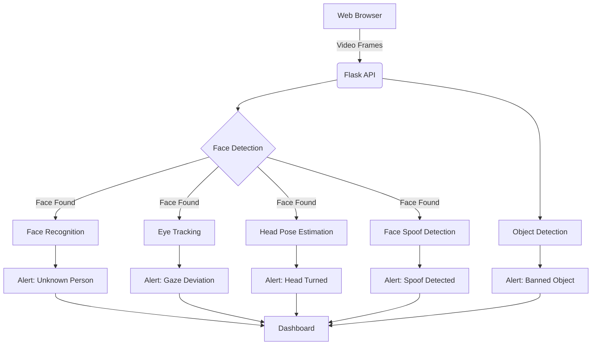

# AI Proctoring System :computer::eyes:

A full-stack computer vision solution that monitors exam integrity using real-time face recognition, gaze tracking, and suspicious activity detection.

---

## Key Features

✅ Real-time face recognition against registered student database  
👁️ Eye gaze & head pose tracking to detect attention shifts  
📱 Banned object detection (phones, laptops, books)  
🎭 Face spoof detection to prevent photo/video impersonation  
👄 Mouth movement analysis to flag potential communication  
📊 Web dashboard with live alerts and activity logs  

---

## Tech Stack

### Computer Vision  
  
  
  

### Backend  
  
  

### Frontend  
  
  

---

## Installation Guide

### 1. Clone Repository
```bash
git clone https://github.com/abhishekmohite55/AI-Powered-Video-And-Image-Processing
cd AI-Powered-Video-And-Image-Processing
```

---

### 2. Setup Environment

#### Option A: Using Conda (Recommended)
```bash
conda env create -f environment.yml
conda activate codeVersion6
```

#### Option B: Using pip
```bash
python -m venv venv
source venv/bin/activate   # On Linux/Mac
venv\Scripts\activate      # On Windows

pip install -r requirements.txt
```

### 3. Download Model Files
Create a `models` directory and download these files:

| File | Purpose | Download Link |
|------|----------|---------------|
| Headpose_customARC_ZoomShiftNoise.hdf5 | Head pose estimation | [Download](https://drive.google.com/drive/folders/1KhIUJT6IvqcBgV8tV7_rG7FjLqhuavO8?usp=drive_link) |
| shape_predictor_68_face_landmarks.dat | Facial landmark detection | [Download](https://drive.google.com/drive/folders/1KhIUJT6IvqcBgV8tV7_rG7FjLqhuavO8?usp=drive_link) |
| yolov3.weights | Object detection | [Download](https://drive.google.com/drive/folders/1KhIUJT6IvqcBgV8tV7_rG7FjLqhuavO8?usp=drive_link) |

Place all files in the `/models` directory.

### 4. Register Students
Create a `student_db` folder.  
Add student face images in format: `[student_name].jpg`  
Example: `Nishant Khanderao.jpg`  

✅ High-quality frontal face photos  
✅ Single person per image  
✅ Well-lit conditions  
✅ Neutral expression  

---

## Running the System

### Start Backend API
```bash
python api.py
```
The API will run at: **http://localhost:5000**

### Launch Web Interface
- Open `test.html` in Chrome/Firefox  
- Enable camera access when prompted  
- Click **Start Proctoring**  

---

## System Architecture



---

## Usage Tips

- For best accuracy, ensure **good lighting on face**  
- Position camera at **eye level**  
- Maintain **1-2 feet distance** from camera  
- Check dashboard periodically for alerts  
- Use **Clear Logs** button before starting a new session  

---

## Troubleshooting

**Problem:** Face not detected  
**Solution:** Adjust lighting, remove glasses, ensure full face visibility  

**Problem:** "Model file missing" error  
**Solution:** Verify all model files are in `/models` directory  

**Problem:** Low FPS  
**Solution:** Reduce camera resolution in `test.html` camera settings  

---
